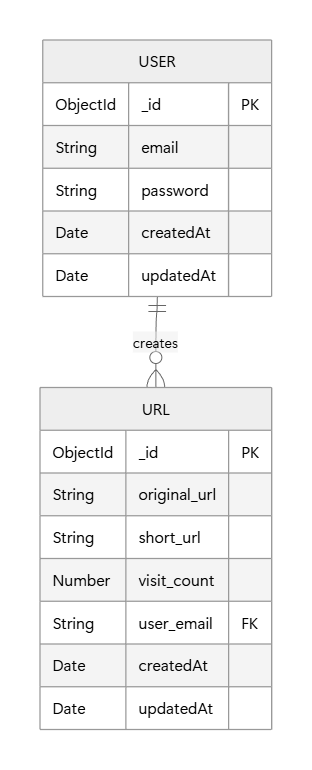
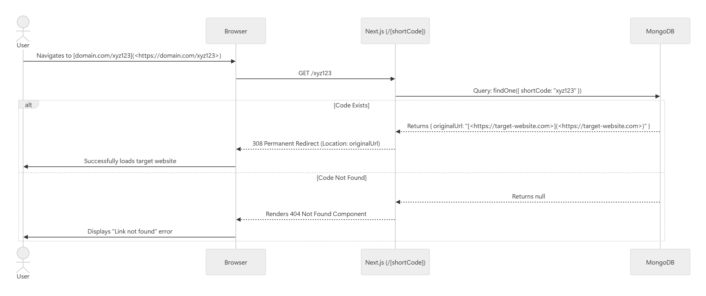
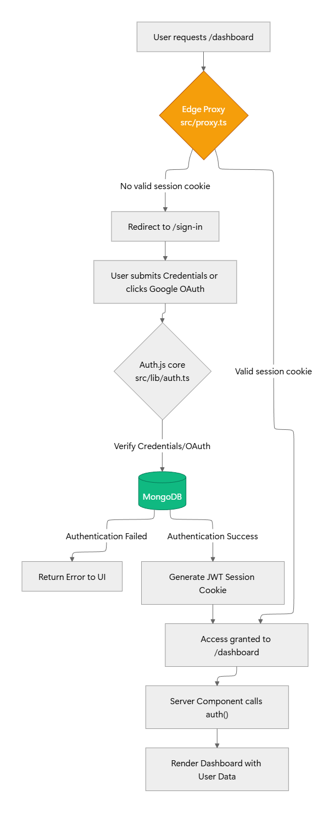

# ShortURL

### Overview:

This URL shortener website allows users to create shorter aliases of long URLs. When a user clicks on the shorten link, they get redirected to the original URL. Short links save space when displayed, printed, or messaged, and users are less likely to mistype shorther URLs.

### Tech Stack:

- Next.js 16.
- MongoDB.
- TailwindCSS.
- Vercel (Edge Functions).
- Google OAuth.
- NextAuth.js.

### Functional Requirements:

- **Authentication & Users**
  - Users can register an account using an email and password (secured via `bcryptjs`).
  - Users can sign in via Google OAuth.
  - Unauthenticated users cannot access the `/dashboard` (protected by Next.js Edge proxy).

- **Core Features**
  - Authenticated users can submit a long URL to be shortened.
  - The system generates a unique, collision-resistant short code.
  - Users can view a list of their previously shortened URLs on their dashboard.

- **Redirection Logic**
  - Anyone (authenticated or not) navigating to `/[shortCode]` is seamlessly redirected to the original long URL.
  - If a short code does not exist, the system serves a custom `404 Not Found` page.

### Database Schema:

The database consists of two primary collections: **Users** and **Urls**. Because Mongoose is configured with `{ timestamps: true }`, both collections automatically inherit `createdAt` and `updatedAt` fields.

#### `users` Collection

Stores authentication credentials and account metadata.
| **Field** | **Type** | **Attributes** | **Description** |
| ----------- | ---------- | -------------- | ---------------------------------------------------------------------------------------------- |
| `_id` | `ObjectId` | Primary Key | Automatically generated unique identifier. |
| `email` | `String` | Required | The user's email address (used for login). |
| `password` | `String` | Required | The hashed password. _(Note: Should ideally be configured with `select: false` for security)._ |
| `createdAt` | `Date` | Auto | Timestamp of when the user registered. |
| `updatedAt` | `Date` | Auto | Timestamp of the last update to the user document. |

#### `urls` Collection

Stores the mapping between the generated short links and their destination URLs.
| **Field** | **Type** | **Attributes** | **Description** |
| -------------- | ---------- | -------------- | ------------------------------------------------------- |
| `_id` | `ObjectId` | Primary Key | Automatically generated unique identifier. |
| `original_url` | `String` | Optional | The full, original destination link. |
| `short_url` | `String` | Optional | The generated short code snippet. |
| `visit_count` | `Number` | Optional | Analytics tracker for how many times the link was used. |
| `user_email` | `String` | Foreign Key | The email of the user who created the link. |
| `createdAt` | `Date` | Auto | Timestamp of when the link was shortened. |
| `updatedAt` | `Date` | Auto | Timestamp of the last update to the link document. |

---

#### Entity-Relationship Diagram



### System Architecture:

The application follows a modern serverless architecture utilizing Next.js 16 App Router. It is designed to be highly available, stateless, and optimized for rapid read operations (redirections) over write operations (link creation).

#### Core Components

- **Frontend Client:** React Server Components (RSC) and Client Components handling the UI, state, and toast notifications.
- **Edge Proxy (Middleware):** Next.js middleware running on the Edge runtime intercepts protected routes (`/dashboard`) to verify JSON Web Tokens (JWTs) before server resources are consumed.
- **Backend API:** Next.js Route Handlers (`/api/*`) executing on Node.js serverless functions to process business logic and database mutations.
- **Database Layer:** MongoDB Atlas storing users and URL mappings, utilizing strict indexing on `shortCode` fields for sub-150ms lookup times.

#### Diagrams

- 1. **The Redirection Flow**
     The primary function of the application is to resolve short codes instantly. When a user requests a short link, the dynamic route `/[shortCode]` intercepts the request, queries the indexed database, and issues a native `308 Permanent Redirect` to preserve SEO and ensure a seamless transition.
     

- 2. **Edge-Protected Authentication**
     Authentication is managed via Auth.js v5. To prevent unauthorized access and reduce server load, route protection is handled at the Edge. If a user attempts to access a protected dashboard without a valid session cookie, they are redirected before the request ever reaches the Node.js backend.

     

### Local Setup Guide:

To run this Next.js application locally, you will need Node.js installed, a MongoDB database (like MongoDB Atlas), and a Google Cloud Console project for OAuth authentication.

#### 1. Clone and Install

First, clone the repository and install the dependencies.

```bash
git clone <your-repo-url>
cd nextjs-url-shortener
npm install
```

#### 2. Environment Variables

Create a new file named `.env` in the root of your project. Copy the variables below into that file and fill in the values.

```bash
# The base URL of your application (used for short link redirection)
NEXT_PUBLIC_URL="http://localhost:3000"

# Auth.js v5 Secret (Required for JWT encryption)
# Generate one quickly by running: npx auth secret
AUTH_SECRET="your_super_secret_random_string"

# Next-Auth v5 local development flag
AUTH_TRUST_HOST=true

# MongoDB Connection String
# Make sure to include your username, password, and database name
MONGODB_URI="mongodb+srv://<username>:<password>@cluster0.mongodb.net/url-shortener?retryWrites=true&w=majority"

# Google OAuth Credentials (for Sign In with Google)
# Generate these in the Google Cloud Console -> APIs & Services -> Credentials
GOOGLE_CLIENT_ID="your_google_client_id.apps.googleusercontent.com"
GOOGLE_CLIENT_SECRET="your_google_client_secret"
```

**Configuration Notes:**

- **MongoDB:** Ensure your current IP address is whitelisted in your MongoDB Atlas Network Access settings, or the application will throw a `Configuration` error during login.
- **Google OAuth:** In your Google Cloud Console, ensure your Authorized Redirect URIs include `http://localhost:3000/api/auth/callback/google`.

#### 3. Start the Development Server

Once your `.env` is configured, start the Next.js development server:

```bash
npm run dev
```

Open [http://localhost:3000](https://www.google.com/search?q=http://localhost:3000) in your browser. You can now register a new account, test the Google OAuth flow, and generate your first short links!
